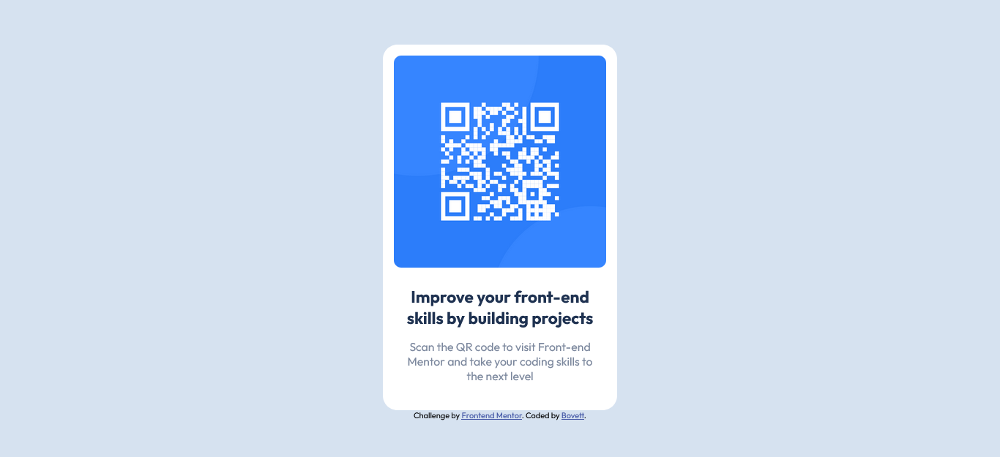

# Frontend Mentor - QR code component solution

This is a solution to the [QR code component challenge on Frontend Mentor](https://www.frontendmentor.io/challenges/qr-code-component-iux_sIO_H). Frontend Mentor challenges help you improve your coding skills by building realistic projects. 

## Table of contents

- [Overview](#overview)
  - [Screenshot](#screenshot)
  - [Links](#links)
- [My process](#my-process)
  - [Built with](#built-with)
  - [What I learned](#what-i-learned)
  - [Continued development](#continued-development)
- [Author](#author)


## Overview

### Screenshot




### Links

- Solution URL: [https://github.com/Bovett/QR_code](https://github.com/Bovett/QR_code)
- Live Site URL: [https://bovett.github.io/QR_code/](https://bovett.github.io/QR_code/)

## My process

### Built with

- Semantic HTML5 markup
- Vanilla CSS


### What I learned

```html
<h1>Some HTML code I'm proud of</h1>
```
```css
/*How to reset the properties of a html document*/
html{
        box-sizing: border-box;
        font-size: 15px;
        font-family: 'Arial Unicode MS', Arial, Helvetica, sans-serif;
}
/*How to pass the properties of the root element to all other child elements*/
*, *:before, *:after {
        box-sizing: inherit;
}
```
### Continued development

Need more practise on CSS. It took me quite a while to apply all the styles correctly.

## Author

- Frontend Mentor - [@Bovett](https://www.frontendmentor.io/profile/Bovett)
- Twitter - [@_bovett](https://www.twitter.com/_bovett)
